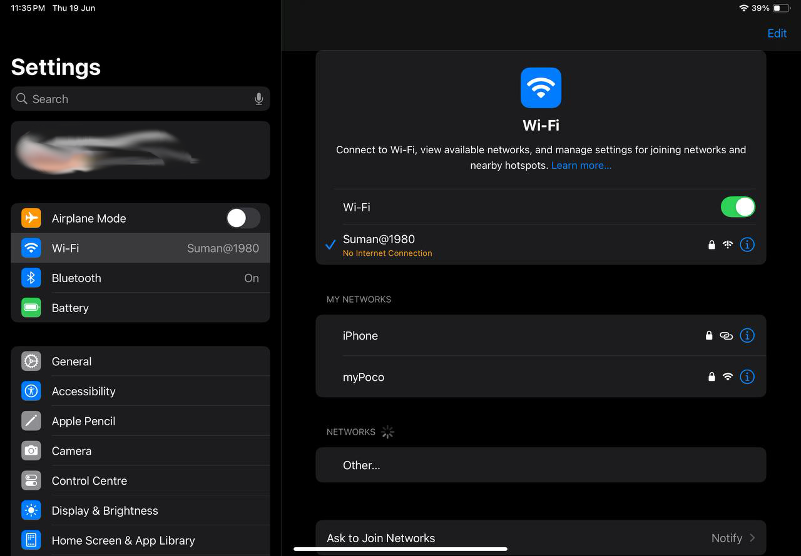
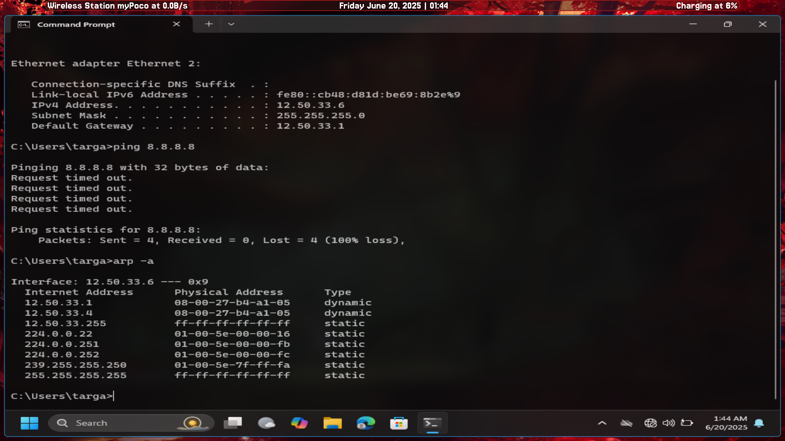
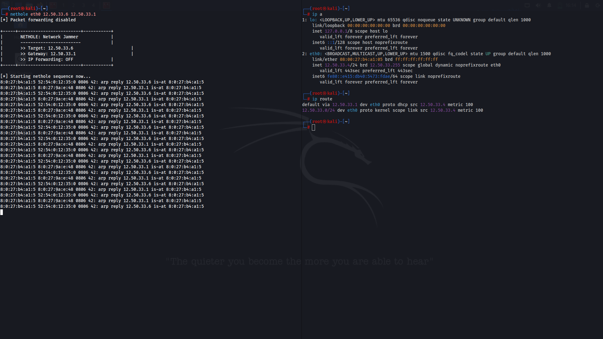
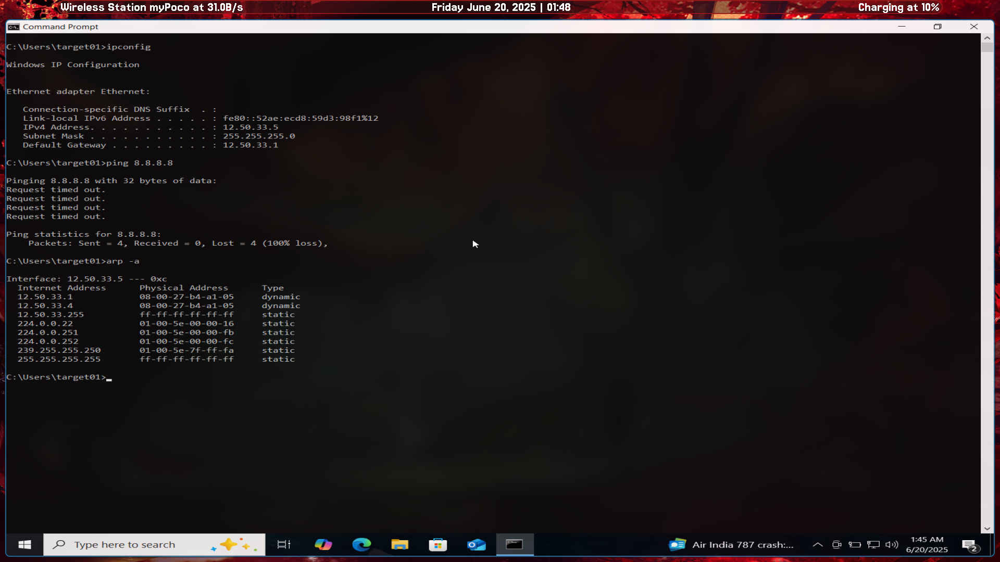
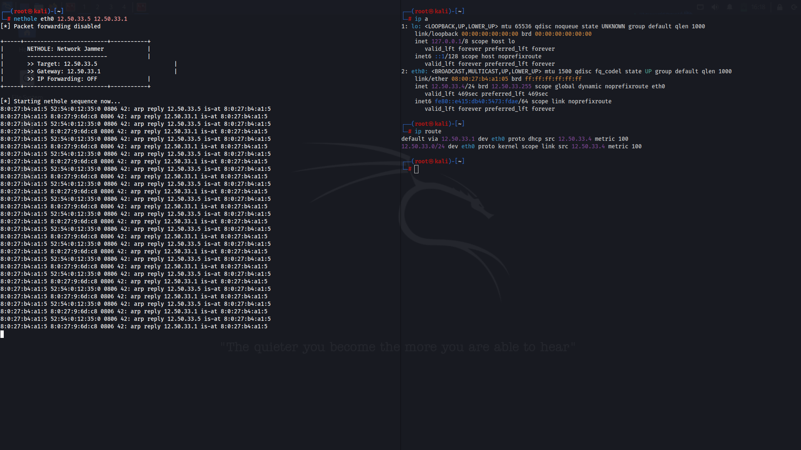

# nethole
*Soft blocking WPA3 with good old arp spoofing*


Now, we all know how annoying **WPA3** is when it comes to trying to deauthenticate it or do almost anything with it from the `aircrack-ng` suite.  

Because **WPA3** uses *Management Frame Protection* , which makes the management frames encrypted.  
The very frames that are used in establishing and maintaining a connection.  

The results:

>  **Deauthentication : DOES NOT WORK**

> **Capturing the handshake : USELESS**

So when I learnt that there is something called ARP spoofing, I had an idea.   
And that very idea is what `nethole` is.

### What it does

`Nethole` takes advantage of the layer 2 concept of **ARP SPOOFING**

What it does is, take help of a tool called `arpspoof` (yeah literally)  
We set up a `Man In The Middle` connection between the target and its gateway and pair that with:  
cutting off __IP forwarding__ using  
`echo 0 > /proc/sys/net/ipv4/ip_forward`

Now the target is , on the surface, *connected* to the wifi access point but there is just **INFINITE buffering** for them.  
Because we are NOT forwarding any requests to the Access Point (Wifi router).

*NO deauths. NO packet captures.  
Just pure sabotage (enough to drive anyone mad with: "WHY IS THE WIFI DOWN WHEN IT SAYS CONNECTED")*



---

### Usage

Use it with the __interface__ you want to attack on, followed by the __target's local IP__ and the __default gateway__  


#### Example:

```
nethole wlan1mon 192.168.42.67 192.168.42.1
```

Again this is different from the classic case of deauthentication,  
but it opens up the way for more exploits within **WPA3** (and hey, it gets the thing done)

---
This is how `nethole` fares so far:  

| Target Device | Results|
|-----------|------------|
|Tested against **WINDOWS 11** | Same results as the Ipad, *INFINITE BUFFERING* and ping requests timing out. | 
|Tested against **WINDOWS 10** | Again, the same case, *INFINITE BUFFERING* and ping requests timing out.  |
|Tested against **XIAOMI PHONES** |  Completely different results, Xiaomi holds out against arp spoofing with both **WPA2 & WPA3** |

Xiamoi uses **arp table hardening** (as it seems) to keep a ***static arp table*** and notices how the router suddenly resolves to  
a new `MAC address` and drops the arp requests by the machine that is trying to arp spoof it.

---
This is how **Windows 11** behaves under `nethole` :  


  

And this is how **Windows 10** behave under it:  


  

### ⚠️ Disclaimer

> This project is intended **strictly for educational and research purposes** only.  
> `nethole` was created to demonstrate potential weaknesses in WPA3 network behavior under specific conditions and to **raise awareness** about the importance of secure network configurations.  
>
> **Do not use this tool on any network you do not own or have explicit permission to test.**  
> Unauthorized use may violate laws or terms of service and is **strongly discouraged**.  
>
> The author takes **no responsibility** for any misuse or damages caused by this tool.  
> By using `nethole`, you agree to use it **ethically and legally**.
