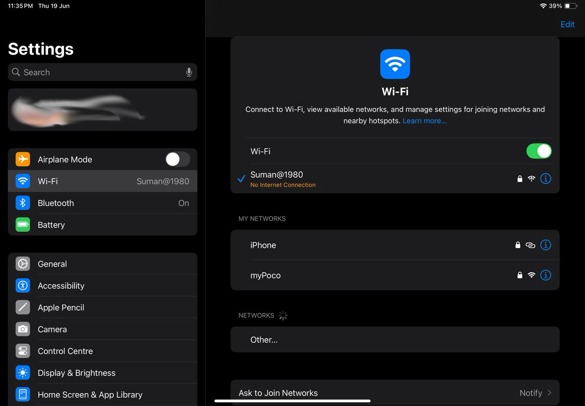

# nethole

Now, we all know how annoying **WPA3** is when it comes to trying to deauthenticate it or do almost anything with it from the `aircrack-ng` suite.  

Because **WPA3** uses *Management Frame Protection* , which makes the management frames encrypted.  
The very frames that are used in establishing and maintaining a connection.  

The results:

>  **Deauthentication : DOES NOT WORK**

> **Capturing the handshake : USELESS**

So when I learnt that there is something called ARP spoofing, I had an idea.   
And that very idea is what `nethole` is.

`Nethole` takes advantage of the layer 2 concept of **ARP SPOOFING**

What it does is, take help of a tool called `arpspoof` (yeah literally)  
We set up a `Man In The Middle` connection between the target and its gateway and pair that with:  
cutting off __IP forwarding__ using  
`echo 0 > /proc/sys/net/ipv4/ip_forward`

Now the target is , on the surface, *connected* to the wifi access point but there is just **INFINTE buffering** for them.  
Because we are NOT forwarding any requests to the Access Point (Wifi router).

Again this is different from the classic case of deauthentication,  
but it opens up the way for more exploits within **WPA3** (and hey, it gets the thing done)

---
This is how `nethole` fares so far:  

Tested against **WINDOWS 11** : Same results as the Ipad, *INFITE BUFFERING* and ping requests timing out.  
Tested against **WINDOWS 10** : Again, the same case, *INFINITE BUFFERING* and ping requests timing out.  
Tested against **XIAOMI PHONES** : Completely different results, Xiaomi holds out against arp spoofing with both **WPA2 & WPA3** 

Xiamoi uses **arp table hardening** (as it seems) to keep a ***static arp table*** and notices how the router suddenly resolves to  
a new `MAC address` and drops the arp requests by the machine that is trying to arp spoof it.
